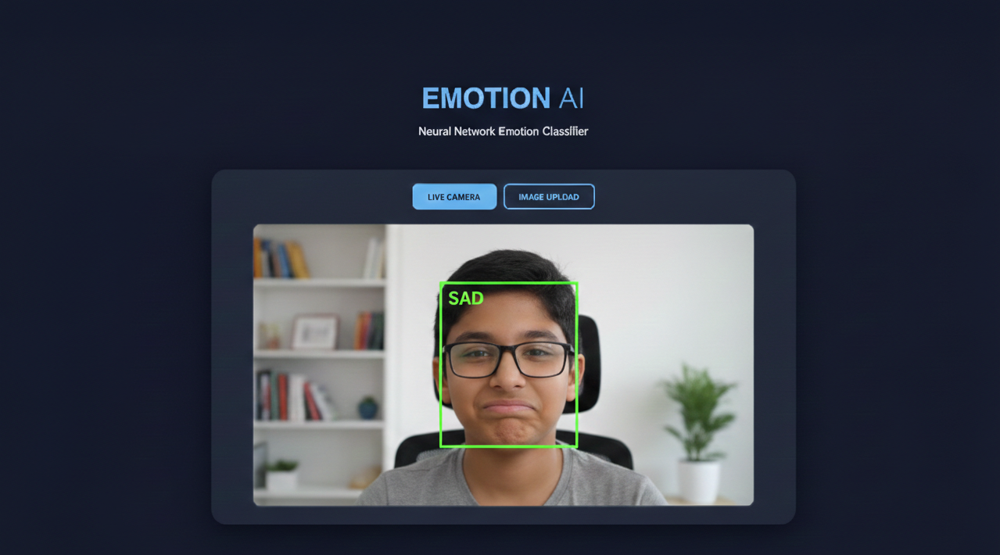
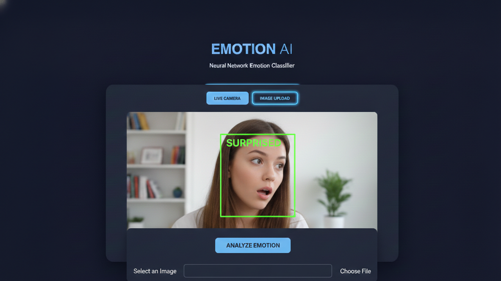
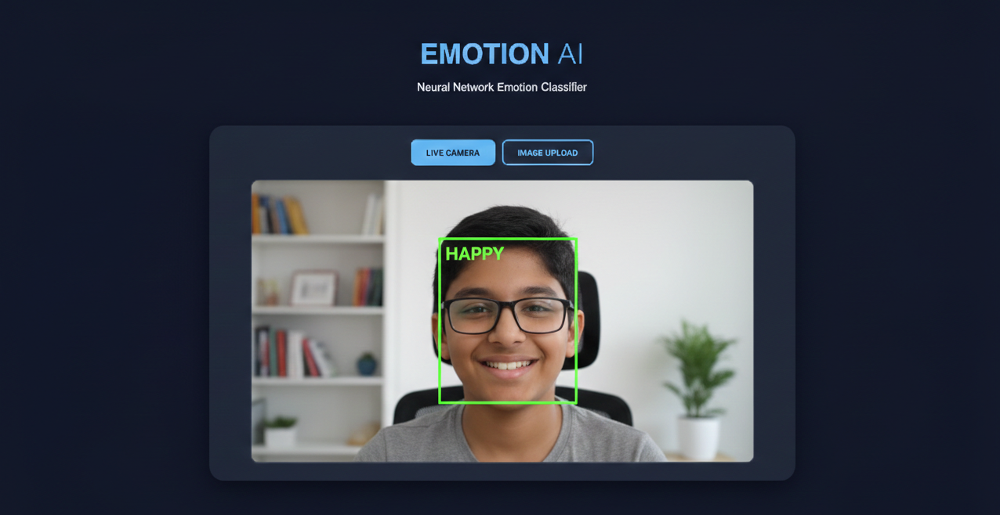

# 🎭 Emotion AI - Neural Network Emotion Classifier

<div align="center">


**Real-Time Emotion Recognition powered by Convolutional Neural Networks**

[](https://huggingface.co/spaces/vendotha/emotion-ai-vision)

[🚀 Live Demo](https://huggingface.co/spaces/vendotha/emotion-ai-vision) • [Features](#-key-features) • [Installation](#-installation) • [Usage](#-usage) • [Tech Stack](#-tech-stack) • [Screenshots](#-screenshots)

</div>

---

## 📖 Overview

**Emotion AI** is an end-to-end deep learning application that performs **real-time emotion recognition** using a Convolutional Neural Network (CNN). The project features a sleek, Vision Pro-inspired web dashboard with glassmorphism aesthetics, supporting both live camera streams and local image uploads with advanced preprocessing capabilities.

### 🎯 Detected Emotions

The model is trained to recognize **7 distinct facial expressions**:

- 😠 **Angry**
- 🤢 **Disgusted**
- 😨 **Fearful**
- 😊 **Happy**
- 😐 **Neutral**
- 😢 **Sad**
- 😲 **Surprised**

---

## 🌐 Try It Now!

**Experience Emotion AI live without any installation!**

<div align="center">

[](https://huggingface.co/spaces/vendotha/emotion-ai-vision)

**[Launch Live Demo →](https://huggingface.co/spaces/vendotha/emotion-ai-vision)**

*No installation required • Works in your browser • Instant results*

</div>

---

## ✨ Key Features

### 🚀 Performance Optimized
- **On-Demand Streaming**: Camera initializes only when needed, saving CPU and battery
- **Real-Time Processing**: Low-latency detection optimized for 640x480 resolution
- **High FPS**: Smooth performance for live emotion tracking

### 🎨 Advanced Computer Vision
- **Lighting Correction**: Built-in Histogram Equalization for accuracy in varied lighting conditions
- **Robust Face Detection**: Fine-tuned Haar Cascade detector filters background noise
- **Multi-Face Support**: Can detect and classify emotions for multiple faces simultaneously

### 💎 Modern Web Interface
- **Vision Pro Inspired Design**: Sleek glassmorphism UI with dark mode aesthetic
- **Dual Input Modes**: Live camera feed and image upload support
- **Responsive Dashboard**: Works seamlessly across devices and screen sizes
- **Interactive Elements**: Loading spinners, error alerts, and smooth transitions

---

## 📸 Screenshots

### 🎭 Emotion Detection in Action

<table>
  <tr>
    <td align="center">
      
      <br />
      <b>Detecting Sadness</b>
      <br />
      Real-time emotion analysis with face tracking
    </td>
    <td align="center">
      
      <br />
      <b>Detecting Surprise</b>
      <br />
      Accurate classification across different expressions
    </td>
  </tr>
  <tr>
    <td align="center" colspan="2">
      
      <br />
      <b>Detecting Happiness</b>
      <br />
      High accuracy even with glasses and varied lighting
    </td>
  </tr>
</table>

---

## 🛠️ Tech Stack

| Category | Technologies |
|----------|-------------|
| **Backend** | Flask (Python) |
| **Computer Vision** | OpenCV (Haar Cascades) |
| **Deep Learning** | TensorFlow/Keras (CNN) |
| **Frontend** | HTML5, CSS3, JavaScript (Fetch API) |
| **UI/UX** | Inter Font, FontAwesome, Glassmorphism |
| **Image Processing** | NumPy, Matplotlib |

---

## 💻 Installation

### Prerequisites

- **Python 3.10.0** (Tested and recommended)
- pip (Python package manager)
- Webcam (for live detection mode)

### Step 1: Clone the Repository

```bash
git clone https://github.com/vendotha/Emotion-AI.git
cd Emotion-AI
```

### Step 2: Install Dependencies

Install all required packages using pip:

```bash
pip install opencv-python keras tensorflow flask matplotlib numpy
```

Or use the requirements file:

```bash
pip install -r requirements.txt
```

#### 📦 Required Dependencies

```
opencv-python>=4.5.0
keras>=2.9.0
tensorflow>=2.9.0
flask>=2.0.0
matplotlib>=3.5.0
numpy>=1.21.0
```

### Step 3: Verify Required Files

Ensure your project directory contains these essential files:

```
Emotion-AI/
├── website.py                              # Flask Backend
├── templates/
│   └── index.html                          # Web Interface
├── emotion_model.h5                        # Pre-trained CNN weights
├── emotion_model.json                      # Model architecture
├── haarcascade_frontalface_default.xml    # Face detection logic
└── requirements.txt                        # Python dependencies
```

---

## 🚀 Usage

> **💡 Quick Start**: Want to try it immediately? Check out our [live demo on Hugging Face Spaces](https://huggingface.co/spaces/vendotha/emotion-ai-vision) - no installation needed!

### Starting the Application

1. **Launch the Flask Server**

   ```bash
   python website.py
   ```

2. **Open Your Web Browser**

   Navigate to:
   ```
   http://127.0.0.1:5000
   ```
   or
   ```
   http://localhost:5000
   ```

3. **Choose Your Mode**

   The dashboard offers two detection modes:

   #### 📹 Live Camera Mode
   - Click the **"LIVE CAMERA"** button
   - Allow browser camera permissions
   - See real-time emotion detection on your face
   - Press ESC or click again to stop

   #### 📤 Image Upload Mode
   - Click the **"IMAGE UPLOAD"** button
   - Select a `.jpg` or `.png` image from your device
   - Click **"ANALYZE EMOTION"**
   - View the detected emotion and download results

---

## 🧠 Model Architecture

The emotion classifier uses a **Convolutional Neural Network (CNN)** trained on the **FER2013 dataset**, which contains thousands of labeled facial expressions.

### Model Pipeline

```
Input Image (48x48 grayscale)
        ↓
Haar Cascade Face Detection
        ↓
Histogram Equalization
        ↓
CNN Feature Extraction
        ↓
Softmax Classification
        ↓
Emotion Label (7 classes)
```

### Training Details

- **Dataset**: FER2013 (Facial Expression Recognition)
- **Input Size**: 48x48 pixels, grayscale
- **Output**: 7 emotion classes
- **Architecture**: Multi-layer CNN with dropout regularization
- **Preprocessing**: Histogram equalization for lighting normalization

---

## 🎯 How It Works

### 1. Face Detection
The application uses OpenCV's **Haar Cascade Classifier** to detect faces in the input (camera feed or uploaded image).

### 2. Preprocessing
- Detected faces are converted to grayscale
- Histogram equalization is applied to normalize lighting
- Images are resized to 48x48 pixels

### 3. Emotion Classification
- The preprocessed face is fed into the CNN model
- The model outputs probability scores for all 7 emotions
- The emotion with the highest probability is displayed

### 4. Real-Time Display
- Bounding box drawn around detected face
- Emotion label displayed above the face
- Confidence score shown (optional)

---

## 🔧 Configuration

### Adjusting Detection Parameters

You can fine-tune the face detection in `website.py`:

```python
# Haar Cascade parameters
faces = face_cascade.detectMultiScale(
    gray_image,
    scaleFactor=1.1,      # Image pyramid scale
    minNeighbors=5,       # Detection quality
    minSize=(30, 30)      # Minimum face size
)
```

### Camera Resolution

Optimize performance by adjusting camera resolution:

```python
# In website.py
camera.set(cv2.CAP_PROP_FRAME_WIDTH, 640)
camera.set(cv2.CAP_PROP_FRAME_HEIGHT, 480)
```

---

## 📊 Performance

- **Inference Speed**: ~30-60 FPS on modern CPUs
- **Model Size**: Lightweight (~5MB)
- **Accuracy**: ~65-70% on FER2013 validation set
- **Latency**: <50ms per frame

---

## 🐛 Troubleshooting

### Camera Not Working

**Issue**: Live camera mode shows black screen or doesn't activate

**Solutions**:
- Check browser permissions for camera access
- Ensure no other application is using the camera
- Try a different browser (Chrome recommended)
- Verify webcam drivers are installed

### Model Not Loading

**Issue**: Error loading `emotion_model.h5` or `emotion_model.json`

**Solutions**:
- Ensure both model files are in the root directory
- Check file permissions
- Verify TensorFlow/Keras installation
- Re-download model files if corrupted

### Poor Detection Accuracy

**Issue**: Emotions are frequently misclassified

**Solutions**:
- Ensure good lighting conditions
- Face the camera directly
- Remove obstructions (hands, masks, etc.)
- Try different facial expressions more distinctly

---

## 🚦 Project Status

- ✅ Real-time emotion detection
- ✅ Image upload support
- ✅ Modern web interface
- ✅ Multi-face detection
- 🔄 Mobile app version (planned)
- 🔄 Model accuracy improvements (in progress)
- 🔄 Additional emotion classes (planned)

---

## 🤝 Contributing

Contributions are welcome! Here's how you can help:

1. **Fork the repository**
2. **Create a feature branch** (`git checkout -b feature/AmazingFeature`)
3. **Commit your changes** (`git commit -m 'Add some AmazingFeature'`)
4. **Push to the branch** (`git push origin feature/AmazingFeature`)
5. **Open a Pull Request**

### Areas for Contribution

- Improving model accuracy
- Adding new emotion classes
- UI/UX enhancements
- Mobile responsiveness
- Documentation improvements
- Performance optimization

---

## 📝 License

This project is licensed under the MIT License - see the [LICENSE](LICENSE) file for details.

---

## 👨‍💻 Developer

<div align="center">

**Developed with ❤️ by Buvananand Vendotha**

Building intelligent vision systems with Python and TensorFlow

[](https://github.com/vendotha)
[](https://linkedin.in/in/vendotha/)

</div>

---

## 🙏 Acknowledgments

- **FER2013 Dataset** - For providing the training data
- **OpenCV** - For robust computer vision tools
- **TensorFlow/Keras** - For the deep learning framework
- **Flask** - For the lightweight web framework
- **FontAwesome** - For beautiful icons

---

## 📧 Contact

Have questions or suggestions? Feel free to reach out!

- **GitHub Issues**: [Create an issue](https://github.com/vendotha/Emotion-AI/issues)
- **Email**: vendotha@gmail.com

---

<div align="center">

### ⭐ Star this repository if you found it helpful!

**Made with 🧠 and ☕**

</div>
